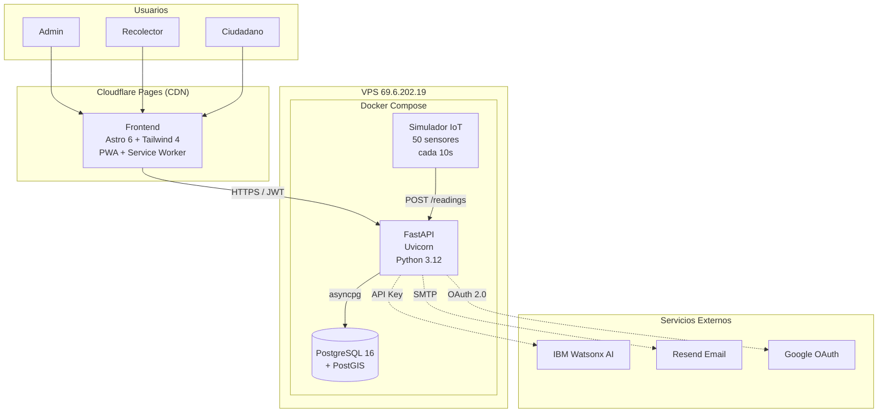
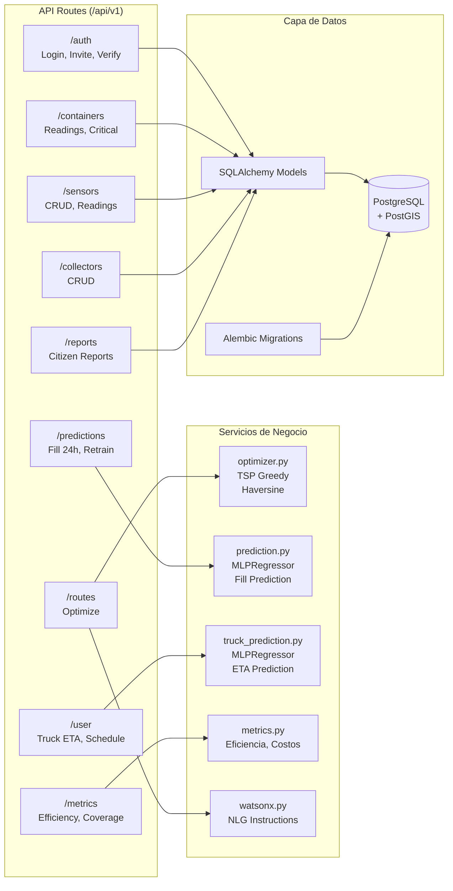
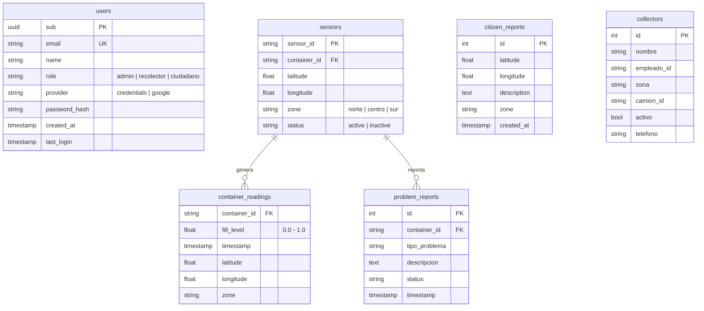
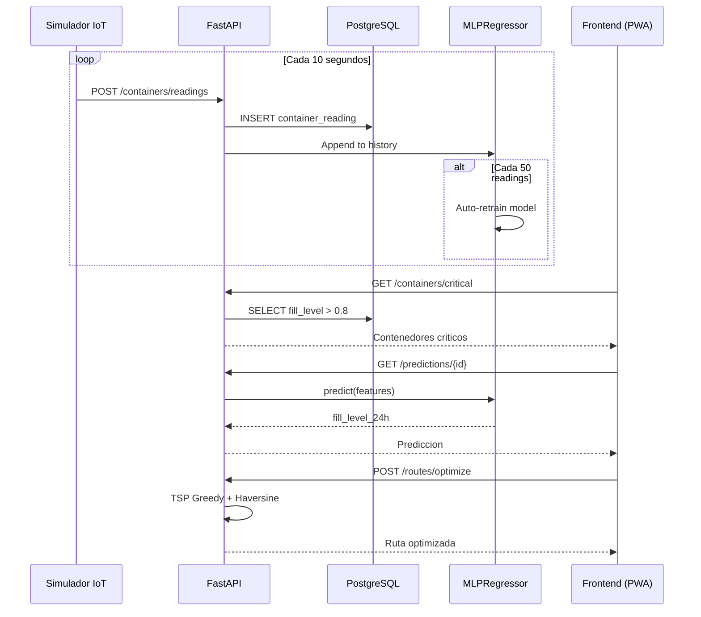
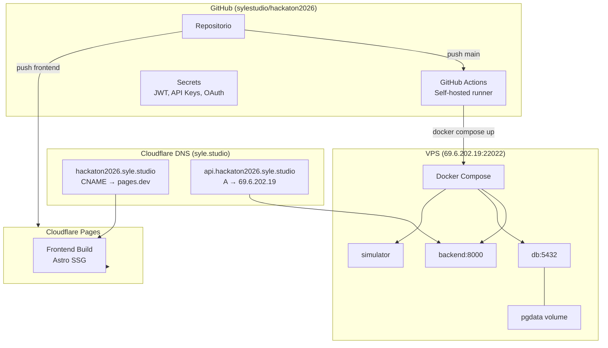
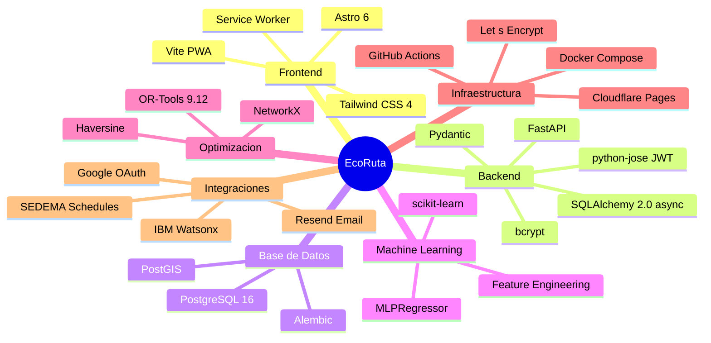

# Arquitectura del Sistema — EcoRuta

## Diagrama General

## Diagrama de Componentes del Backend

## Modelo de Datos

## Flujo de Datos en Tiempo Real

## Infraestructura y Despliegue

## Stack Tecnologico

